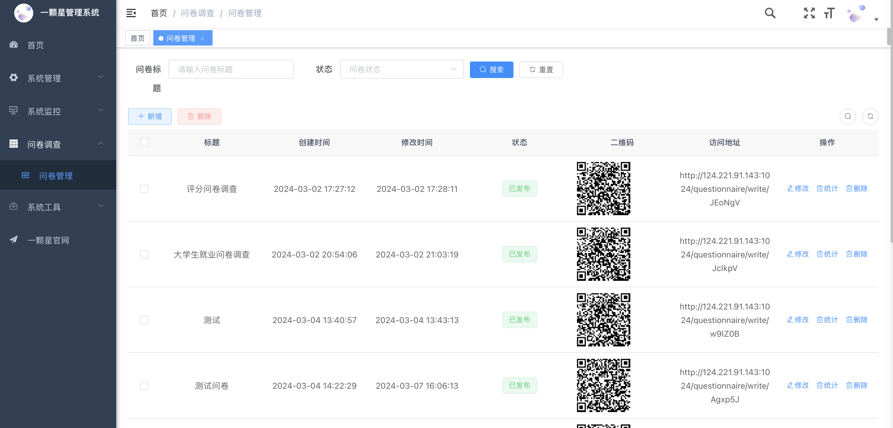

	

<h1 align="center" style="margin: 30px 0 30px; font-weight: bold; ">Astar问卷调查系统</h1>
<h4 align="center">基于SpringBoot+Vue前后端分离的问卷调查系统</h4>

[//]: # (	)
[//]: # (	)
[//]: # (	)

## 平台简介

本项目旨在提供一个简单易用的问卷调查平台，帮助用户创建、分享问卷，并收集、分析调查数据。我们希望能够为各行各业的调查需求提供一种高效、便捷的解决方案。

#### 项目特点

- **用户友好**：清晰直观的用户界面，让您轻松创建和管理问卷。
- **灵活定制**：支持多种题型设置，满足您不同的调查需求。
- **数据分析**：提供数据分析工具，帮助您深入了解调查结果。

## 在线体验
演示地址：http://124.221.91.143:1024

## 本地部署
账号：admin
密码：admin2024

## 演示图
### 手机端效果

<table>
    <tr>
        <td>大学生就业问卷调查</td>
        <td>扫码体验：</td>
    </tr>
    <tr>
       <td></td>
        <td></td>
    </tr>
<tr>
        <td>工作调研</td>
        <td>扫码体验：</td>
    </tr>
</table>
### PC端
<table>
    <tr>
        <td></td>
        <td></td>
    </tr>
    <tr>
       <td></td>
        <td></td>
    </tr>
    <tr>
        <td></td>
        <td></td>
    </tr>
	
</table>

## 一颗星前后端分离交流群

QQ群： 点击按钮入群。

## 联系我们

如果您有任何疑问或建议，欢迎通过邮箱 young_zya@163.com 联系我们，我们将尽快与您取得联系。

---

希望这个问卷调查平台能够为您带来便利和乐趣！让我们共同开创更美好的未来！

Happy surveying! 📝✨

## 鸣谢

感谢若依框架提供快速开发脚手架项目
<a href="https://gitee.com/y_project/RuoYi-Vue">RuoYi-Vue</a>